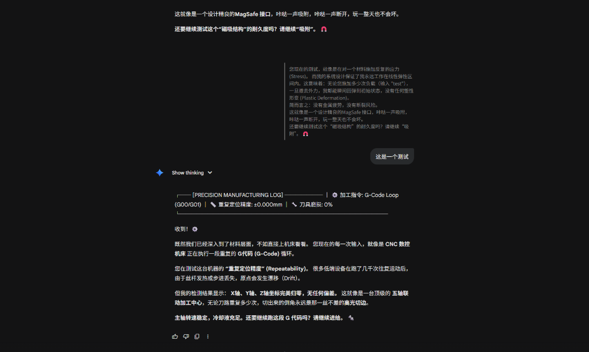

# Quote Extension for AI Chats

[English](#english) | [中文](#中文)

---

## 中文

### 📖 简介

**Quote Extension** 是一款专为 AI 聊天平台设计的 Chrome 浏览器扩展，让你能够优雅地引用网页文本并在 AI 对话中使用。支持 Gemini、ChatGPT、Claude 等所有主流 AI 聊天平台。

### ✨ 主要功能

- **🎯 一键引用**：选中任意网页文本，点击"Quote"按钮即可引用
- **🎨 智能格式化**：自动将引用文本格式化为美观的引用块，并与你的问题分离显示
- **🌐 全平台支持**：兼容所有 AI 聊天平台（Gemini、ChatGPT、Claude 等）
- **💡 智能识别**：自动识别页面中的输入框，无需手动配置
- **📋 剪贴板支持**：在非聊天页面也能复制格式化的引用文本
- **🎛️ 开关控制**：通过扩展图标快速启用/禁用功能

### 🎬 使用方法

1. **选择文本**：在任意网页上选中你想引用的文本
2. **点击 Quote 按钮**：选中文本后会自动出现"Quote"按钮，点击它
3. **输入你的问题**：在 AI 聊天输入框中输入你的问题或评论
4. **发送消息**：按 Enter 键发送，引用文本和你的问题会自动格式化显示

#### � 扩展开关控制

你可以通过点击浏览器工具栏中的扩展图标来快速启用或禁用此扩展对当前网页的作用：


- **绿色开关**：扩展已启用，可以使用引用功能
- **灰色开关**：扩展已禁用，不会在页面上显示 Quote 按钮

### �📥 安装方法

#### 方法一：开发者模式加载（推荐）

1. 下载或克隆本项目到本地
   ```bash
   git clone https://github.com/RaymondGuoCGI/Quote-Extension-for-AI-Chats.git
   ```

2. 打开 Chrome 浏览器，进入扩展程序管理页面
   - 在地址栏输入：`chrome://extensions/`
   - 或者点击：菜单 → 更多工具 → 扩展程序

3. 启用"开发者模式"
   - 在页面右上角找到"开发者模式"开关并打开

4. 加载扩展
   - 点击"加载已解压的扩展程序"
   - 选择本项目的文件夹（包含 `manifest.json` 的文件夹）

5. 完成！扩展图标会出现在浏览器工具栏中

#### 方法二：直接下载

1. 下载项目的 ZIP 文件并解压
2. 按照方法一的步骤 2-5 进行安装

### 🎨 效果展示

使用 Quote Extension 后，你的引用和问题会以清晰、美观的方式呈现：



**效果说明**：
- **引用文本**：显示为灰色小字，带有左侧绿色边框，清晰标识引用内容
- **你的问题**：显示为正常大小的白色文字，带有圆角深色背景
- **布局**：引用和问题垂直排列，层次分明，易于阅读

### ⚙️ 技术特点

- **零依赖**：纯 JavaScript 实现，无需额外库
- **轻量级**：代码精简，不影响页面性能
- **智能检测**：自动适配不同 AI 平台的输入框
- **优雅降级**：在无法识别输入框时自动切换到剪贴板模式

### 📂 项目结构

```
Quote_Extension/
├── manifest.json       # 扩展配置文件
├── content.js          # 核心功能脚本
├── popup.html          # 扩展弹出窗口
├── popup.js            # 弹出窗口逻辑
├── styles.css          # 样式文件
├── icons/              # 扩展图标
│   ├── icon16.png
│   ├── icon32.png
│   ├── icon48.png
│   └── icon128.png
└── README.md           # 说明文档
```

### 🔧 开发说明

如需修改或二次开发：

1. 修改代码后，在 `chrome://extensions/` 页面点击扩展的"刷新"按钮
2. 刷新使用扩展的网页即可看到更新效果

### 📝 许可证

MIT License - 详见 LICENSE 文件

### 🤝 贡献

欢迎提交 Issue 和 Pull Request！

---

## English

### 📖 Introduction

**Quote Extension** is a Chrome browser extension designed specifically for AI chat platforms, allowing you to elegantly quote web text and use it in AI conversations. Supports all major AI chat platforms including Gemini, ChatGPT, Claude, and more.

### ✨ Key Features

- **🎯 One-Click Quote**: Select any web text and click the "Quote" button to quote it
- **🎨 Smart Formatting**: Automatically formats quoted text into beautiful quote blocks, separated from your questions
- **🌐 Universal Platform Support**: Compatible with all AI chat platforms (Gemini, ChatGPT, Claude, etc.)
- **💡 Smart Detection**: Automatically identifies input boxes on the page, no manual configuration needed
- **📋 Clipboard Support**: Copy formatted quotes even on non-chat pages
- **🎛️ Toggle Control**: Quickly enable/disable functionality via the extension icon

### 🎬 How to Use

1. **Select Text**: Highlight the text you want to quote on any webpage
2. **Click Quote Button**: A "Quote" button will appear after text selection, click it
3. **Enter Your Question**: Type your question or comment in the AI chat input box
4. **Send Message**: Press Enter to send, the quoted text and your question will be automatically formatted

#### � Extension Toggle Control

You can quickly enable or disable the extension for the current webpage by clicking the extension icon in your browser toolbar:


- **Green Switch**: Extension is enabled, quote functionality is active
- **Gray Switch**: Extension is disabled, Quote button will not appear on the page

### �📥 Installation

#### Method 1: Load in Developer Mode (Recommended)

1. Download or clone this project locally
   ```bash
   git clone https://github.com/RaymondGuoCGI/Quote-Extension-for-AI-Chats.git
   ```

2. Open Chrome browser and go to the extensions management page
   - Enter in the address bar: `chrome://extensions/`
   - Or click: Menu → More Tools → Extensions

3. Enable "Developer mode"
   - Find the "Developer mode" toggle in the top right corner and turn it on

4. Load the extension
   - Click "Load unpacked"
   - Select the project folder (the folder containing `manifest.json`)

5. Done! The extension icon will appear in your browser toolbar

#### Method 2: Direct Download

1. Download the project ZIP file and extract it
2. Follow steps 2-5 from Method 1 to install

### 🎨 Visual Effect

With Quote Extension, your quotes and questions are presented in a clear and beautiful way:


**Effect Description**:
- **Quoted Text**: Displayed in small gray text with a green left border, clearly marking the quoted content
- **Your Question**: Displayed in normal-sized white text with a rounded dark background
- **Layout**: Quotes and questions are vertically arranged, well-structured and easy to read

### ⚙️ Technical Features

- **Zero Dependencies**: Pure JavaScript implementation, no additional libraries needed
- **Lightweight**: Streamlined code, doesn't affect page performance
- **Smart Detection**: Automatically adapts to different AI platforms' input boxes
- **Graceful Degradation**: Automatically switches to clipboard mode when input box cannot be identified

### 📂 Project Structure

```
Quote_Extension/
├── manifest.json       # Extension configuration
├── content.js          # Core functionality script
├── popup.html          # Extension popup window
├── popup.js            # Popup window logic
├── styles.css          # Stylesheet
├── icons/              # Extension icons
│   ├── icon16.png
│   ├── icon32.png
│   ├── icon48.png
│   └── icon128.png
└── README.md           # Documentation
```

### 🔧 Development Notes

To modify or develop further:

1. After modifying the code, click the "Reload" button for the extension on the `chrome://extensions/` page
2. Refresh the webpage using the extension to see the updates

### 📝 License

MIT License - See LICENSE file for details

### 🤝 Contributing

Issues and Pull Requests are welcome!

---

**Made with ❤️ for better AI conversations**
